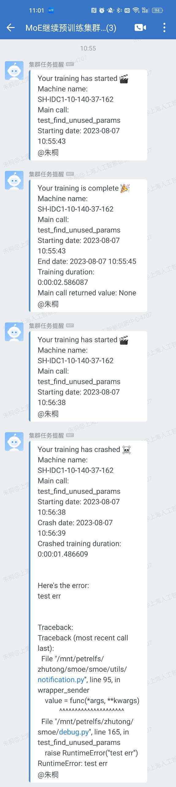
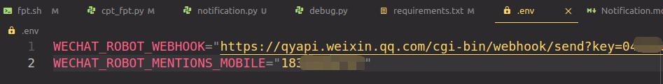

# 💬 Notification

## WeChatWork Notification



1. You should create a WeChat Work group if you don't have one.
2. Add a group robot from the group settings panel, and get the **webhook url**.
3. Create an env file: `cp .env.example .env`
4. Update the content in the `.env` file, make sure the webhook url is correctly configured. If you'd like to AT someone in the group, you should update the mobile phone number.
   
5. Add notification decorator to the code, and you would see the notification messages in the chat group:
    ```python
    from smoe.utils.notification import wechat_sender

    @wechat_sender()
    def main():
        raise RuntimeError("error testing")

    if __name__ == "__main__":
        main()
    ```
