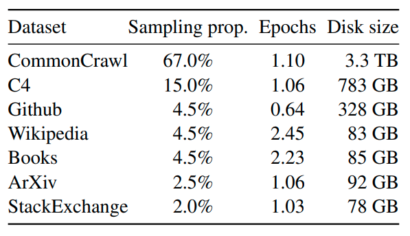

# LLaMA-Moeficaiton

LLaMA参考代码：**transformers**库，引用路径`transformers.models.llama`

Moefication参考代码：https://github.com/thunlp/MoEfication

<br />

## 文件结构

| 文件夹          | 说明                                                  |
| --------------- | ----------------------------------------------------- |
| llama_data      | 用于训练MoE门控网络的数据                             |
| llama_download  | 用于下载LLaMA模型                                     |
| llama_moe       | MoE版LLaMA的模型实现，基于transformers库修改          |
| run_moefication | 用于将普通的LLaMA转化为使用Moefication实现的LLaMA-MoE |

<br />

## LLaMA-MoE的加载与使用

与基于transformers库的LLaMA相同，详情请见示例代码`test_llama_moe_transformers.py`。

<br />

## 转换流程

### 1. 下载LLaMA模型并转换为transformers库的格式

> 如果已经下载了LLaMA模型，并进行了transformers库的格式转换，可跳过该步骤。

修改`./llama_download/download_llama.sh`文件前3行中的`MODEL_SIZE`与`TARGET_FOLDER`变量，之后运行`bash download_llama.sh`下载LLaMA模型。

```sh
PRESIGNED_URL="https://agi.gpt4.org/llama/LLaMA/*"
MODEL_SIZE="7B,13B"  # 30B,65B
TARGET_FOLDER="" # where all files should end up

declare -A N_SHARD_DICT

N_SHARD_DICT["7B"]="0"
N_SHARD_DICT["13B"]="1"
......
```

运行`./llama_download/convert_llama_weights_to_hf.py`文件，并传入`input_dir`，`model_size`，`output_dir`参数，将原版LLaMA模型转换为transformers库可识别的格式。

```sh
python convert_llama_weights_to_hf.py --input_dir <SOURCE_FOLDER> --model_size 7B --output_dir <TARGET_FOLDER>
```

如果上述命令报错，可尝试在运行时设置`PROTOCOL_BUFFERS_PYTHON_IMPLEMENTATION`系统变量为`python`，即运行以下命令：

```sh
PROTOCOL_BUFFERS_PYTHON_IMPLEMENTATION=python python convert_llama_weights_to_hf.py --input_dir <SOURCE_FOLDER> --model_size 7B --output_dir <TARGET_FOLDER>
```

<br />

### 2. 进行LLaMA-MoE转化

> 运行命令可参照目录`./run_moefication/`下的`sh`文件进行修改，也可直接命令行调用`python`文件。

Moefication主要包含四个阶段。

1. 将模型中的dense层参数进行分割，得到n个相互独立的子集（即n个专家），**并保存各神经元所对应的专家索引**；
2. 使用LLaMA对预训练数据进行推理，**保存LLaMA的中间层输入输出**，作为门控网络的训练数据。
2. 训练用于选择专家的门控网络，**并保存门控网络的参数**；
3. **通过保存的索引与门控网络参数**，将LLaMA模型转换为MoE形式。

<br />

#### 2.1 进行专家划分，保存各神经元所对应的专家索引 (split)

> Moefication原文提供了***clustering***与***graph***两种参数分割方式，两者效果近似相同。
>
> 此处使用了更加通用的***clustering***分割方式。

运行`./run_moefication/llama_split_clustering.py`文件，并传入下述参数：

| 参数名      | 说明                                                         |
| ----------- | ------------------------------------------------------------ |
| model_path  | transformers库格式的LLaMA模型的路径                          |
| save_path   | 保存专家划分后的index文件的路径，会该位置下自动创建名如"xxx-xxxExpert-Split-Clustering"的文件夹进行保存 |
| templates   | 专家划分所依据的网络参数模板，默认为"layers.{}.mlp.gate_proj.weight" |
| num_experts | 专家划分的数量                                               |

下面为运行命令的范例：

```sh
python llama_split_clustering.py --model_path <MODEL_PATH>/llama_7B --save_path ../llama_moe_temp_files --num_experts 8
```

上述命令运行结束后，会在`../llama_moe_temp_files/llama_7B-8Expert-Split-Clustering`路径下生成若干文件，保存了dense层各神经元所对应的专家索引，名称格式如下：

```sh
layers.0.mlp.gate_proj.weight
layers.1.mlp.gate_proj.weight
layers.2.mlp.gate_proj.weight
......
```

<br />

#### 2.2 获取LLaMA的中间层特征 (get_hidden_features)

##### 2.2.1 预训练数据准备

训练MoE门控网络需要使用LLaMA的预训练数据，下图为LLaMA预训练时各数据集的采样比例。



此处在`./llama_data`文件夹下提供了上述数据集的子集，使用前先解压`zip`文件，得到以`jsonl`格式存储的数据集。

提供的数据集中各个数据集的token数量基本相近，具体的比例分配在`./run_moefication/llama_get_hidden_features.py`中实现。

##### 2.2.2 使用LLaMA进行推理

运行`./run_moefication/llama_select_mlp.py`文件，并传入下述参数：

| 参数名                | 说明                                                         |
| --------------------- | ------------------------------------------------------------ |
| model_path            | transformers库格式的LLaMA模型的路径                          |
| train_data_path       | LLaMA预训练数据的保存路径 (**步骤2.2.1**)                    |
| train_data_cache_path | LLaMA预训练数据的缓存保存路径，用于保存与读取数据缓存，减少数据处理时间 |
| save_path             | 保存门控网络参数文件的位置，会该位置下自动创建名如"xxx-Hidden-Features"的路径进行保存 |
| templates             | 专家划分所依据的网络参数模板，默认为"layers.{}.mlp.gate_proj.weight" |
| data_use_percent      | 所有数据集中数据的使用比例，用于调节训练使用的数据量<br />3.5M的token在LLaMA 7B上得到的中间层输出文件总大小约4.5T |
| batch_size            | 单次推理的batch_size，根据显存大小调节                       |
| save_interval         | 保存参数的batch间隔，调大会影响显存占用，但可以减少保存的文件个数 |

推理代码使用了torch原生多卡形式，需使用`python -m torch.distributed.launch`运行，以下为运行命令的范例：

```sh
python -m torch.distributed.launch --nproc_per_node=8 llama_get_hidden_features.py --model_path <MODEL_PATH>/llama_7B --train_data_path ../llama_data --train_data_cache_path ../llama_data_cache --save_path ../llama_moe_temp_files --data_use_percent 0.01 --save_interval 1 --batch_size 4
```

上述命令运行结束后，会在`../llama_moe_temp_files/llama_7B-Hidden-Features`路径下生成若干文件，保存了中间层输入输出，名称格式如下：

```sh
-- hidden_inputs
    0_0.pth
    0_1.pth
    0_2.pth
    ......
-- hidden_gate_outputs
    0_0.pth
    0_1.pth
    0_2.pth
    ......
```

<br />

#### 2.3 训练专家选择网络，保存门控网络的参数 (select)

> Moefication原文提供了***Similarity***与***MLP***两种门控机制。
>
> 此处选择常规的MLP作为门控网络，网络输出对应各个专家的选择分数，该方案效果较好。

运行`./run_moefication/llama_select_mlp.py`文件，并传入下述参数：

| 参数名               | 说明                                                         |
| -------------------- | ------------------------------------------------------------ |
| model_path           | transformers库格式的LLaMA模型的路径                          |
| split_file_path      | **步骤2.1**中保存的专家索引路径                              |
| hidden_features_path | **步骤2.2**中保存的LLaMA中间层特征路径                       |
| save_path            | 保存门控网络参数文件的位置，会该位置下自动创建名如"xxx-xxxExpert-Select-MLP"的路径进行保存 |
| templates            | 专家划分所依据的网络参数模板，默认为"layers.{}.mlp.gate_proj.weight" |
| select_criterion     | 专家划分的依据指标，有plain、positive、l2_norm三种方式，默认使用l2_norm |
| num_experts          | 专家划分的数量                                               |
| num_selects          | 专家选择的数量                                               |
| specify_layer        | 指定对哪些层进行划分，用于并行执行划分操作，**留空则对所有层进行划分**<br />如LLaMA 7B有32层，则可使用4条命令，分别指定0-7、8-15、16-23、24-32进行并行训练 |
| use_softmax          | 添加后则使用Softmax激活MoE Gate输出，建议添加                |

下面为运行命令的范例：

```sh
python llama_split_clustering.py --model_path <MODEL_PATH>/llama_7B --split_file_path ../llama_moe_temp_files/llama_7B-8Expert-Split-Clustering --hidden_features_path ../llama_moe_temp_files/llama_7B-Hidden-Features --save_path ../llama_moe_temp_files --select_criterion l2_norm --num_experts 8 --num_selects 2 --use_softmax
```

上述命令运行结束后，会在`../llama_moe_temp_files/llama_7B-8Expert-Select-MLP`路径下生成若干文件，保存了各个门控网络的参数，名称格式如下：

```sh
layers.0.mlp.gate_proj.weight
layers.1.mlp.gate_proj.weight
layers.2.mlp.gate_proj.weight
......
```

<br />

#### 2.4 转换LLaMA模型并保存 (convert)

修改`./run_moefication/llama_convert.py.py`文件第4行的路径为项目根路径。

```python
sys.path.append("")  # 修改为项目根路径，如"/home/dongdz/workspace/llama-moefication/"
```

运行`./run_moefication/llama_convert.py`文件，并传入下述参数：

| 参数名           | 说明                                                         |
| ---------------- | ------------------------------------------------------------ |
| model_path       | transformers库格式的LLaMA模型的路径                          |
| split_file_path  | **步骤2.1**中保存的专家索引路径                              |
| select_file_path | **步骤2.3**中保存的门控网络参数路径                          |
| save_path        | 保存转换后的transformers库格式的LLaMA-MoE模型的路径          |
| templates        | 专家划分所依据的网络参数模板，默认为"layers.{}.mlp.gate_proj.weight" |
| num_experts      | 专家划分的数量                                               |
| num_selects      | 专家选择的数量                                               |
| convert_type     | 转换的模型类别，可选项如下：<br />LlamaMoEModel、LlamaMoEForCausalLM、LlamaMoEForSequenceClassification |

下面为运行命令的范例：

```sh
python llama_convert.py --model_path <MODEL_PATH>/llama_7B --split_file_path ../llama_moe_temp_files/llama_7B-8Expert-Split-Clustering --select_file_path ../llama_moe_temp_files/llama_7B-8Expert-Select-MLP --save_path <MODEL_PATH>/llama_7B-MoE --num_experts 8 --num_selects 2 --convert_type LlamaMoEForCausalLM
```

上述命令运行结束后，会在`<MODEL_PATH>/7B-MoE`路径下保存LLaMA-MoE模型。

<br />

## 代码相关——MoE实现逻辑

可以自己看`./llama_moe/moe_utils/`下的代码，其中`moe_layers.py`是封装好的MoE层，用于直接调用。
